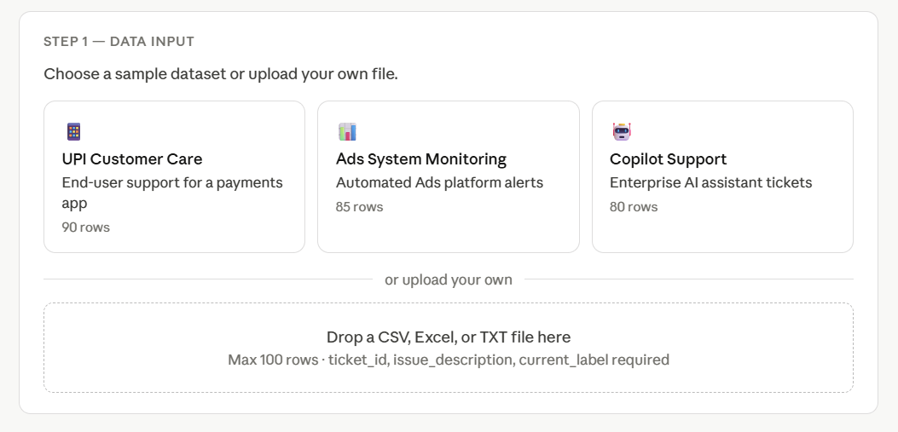
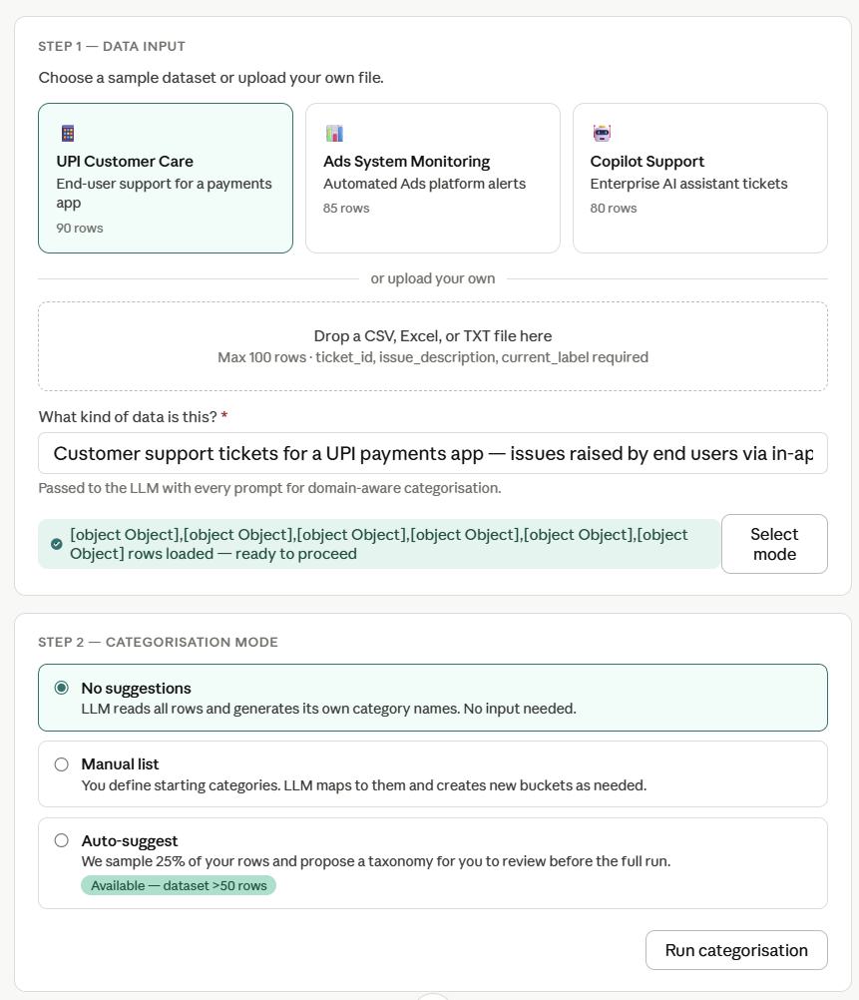
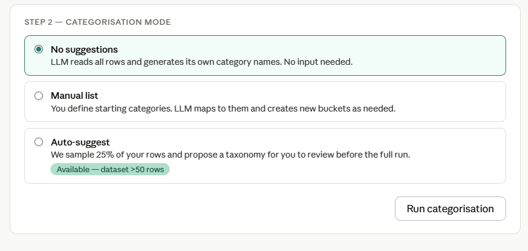
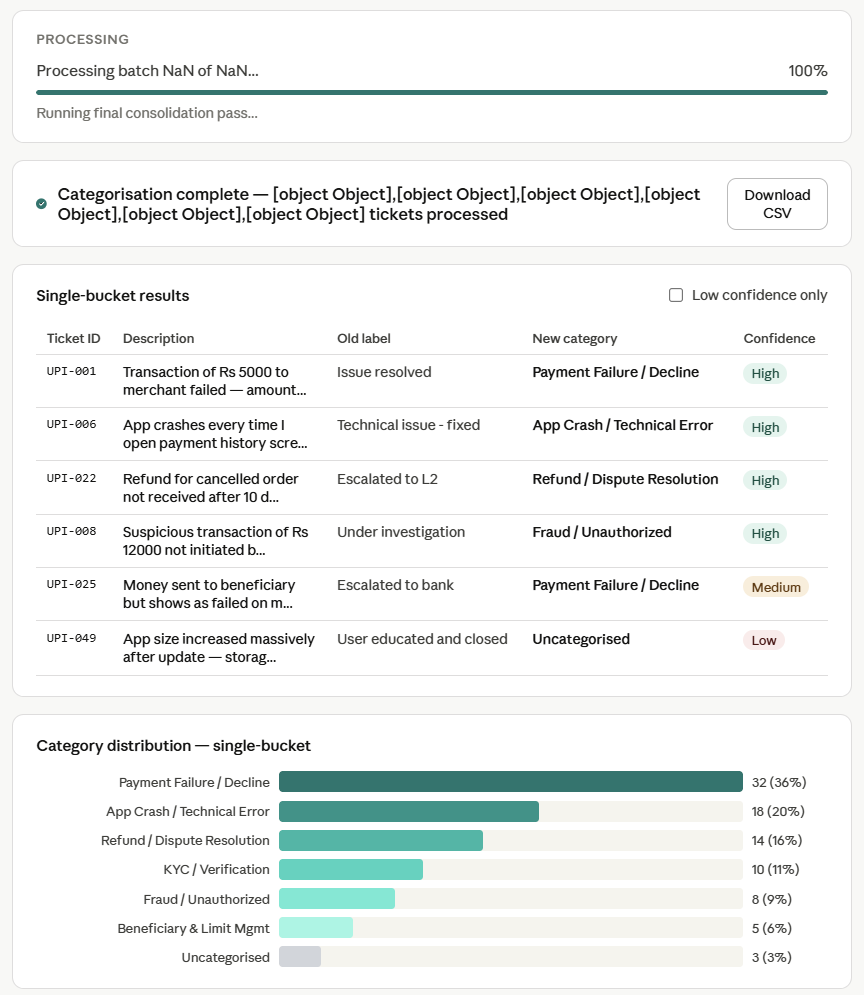
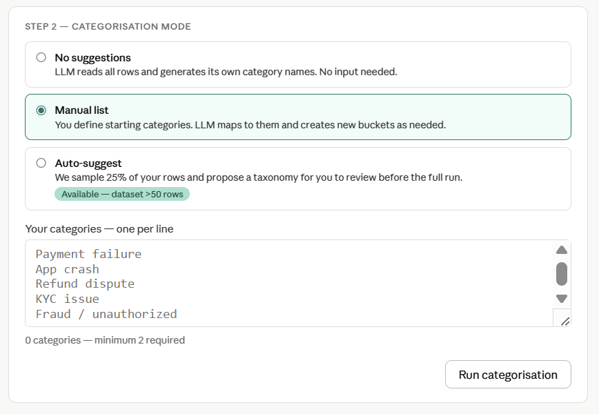
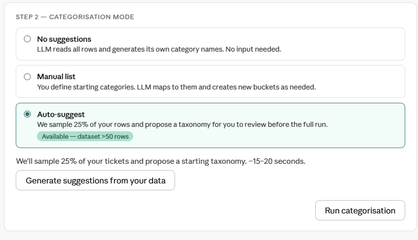
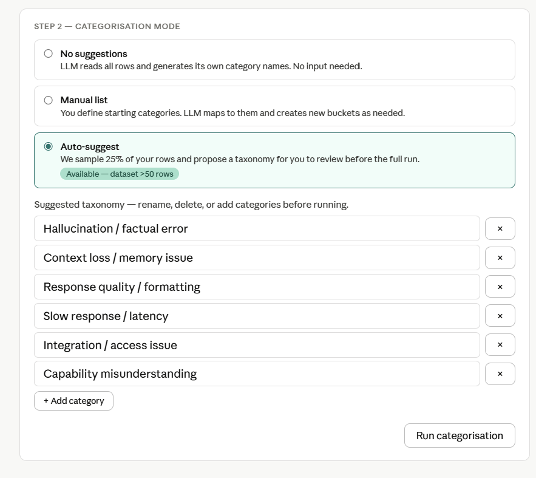
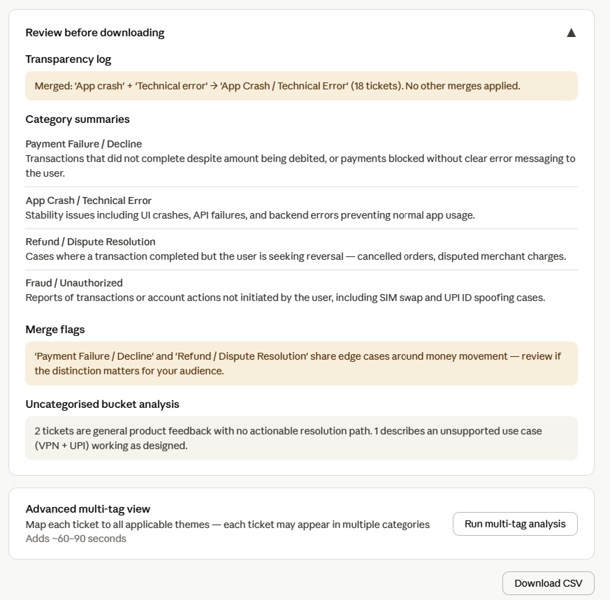
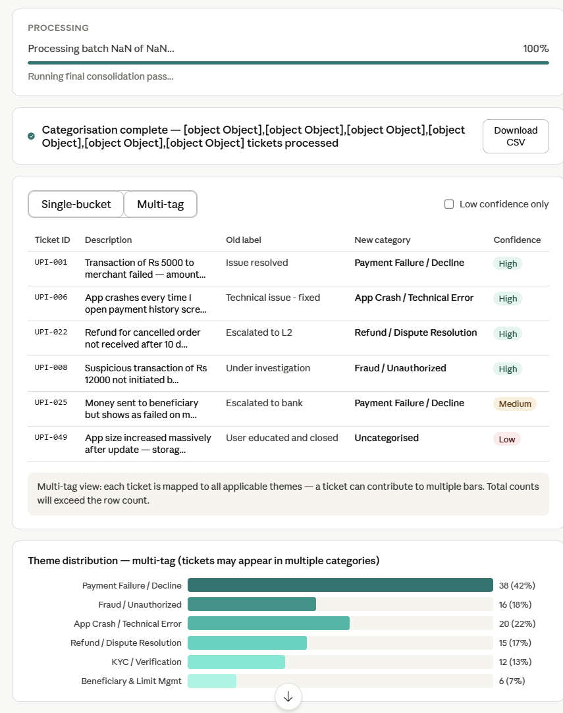

# 03 — UX Flow & Wireframe

*llm-issue-categorizer · Last updated: April 2026*

---

## Interface Structure Overview

The app is a single-page Streamlit application — no tabs, no navigation. 
The user moves through a linear sequence of steps, each revealed 
progressively as the previous step is completed. Completed steps remain 
visible above the current step — the user can always see what they did 
and where they are.

**Five stages, always in this order:**

```
[1. Data Input & Context]
        ↓
[2. Row Validation]
        ↓
[3. Mode Selection & Configuration]
        ↓
[4. Processing]
        ↓
[5. Results, Review & Download]
```

No step is skippable. No step renders until the previous one is complete. 
This keeps the UI uncluttered and eliminates the most common failure mode 
in form-heavy tools: the user configuring something before the app has 
the data it needs to make that configuration valid.

A "Start over" button is always visible in the top-right header. It resets 
all steps, clears all selections, and returns the user to the landing 
state — enabling clean re-runs with different samples or modes.

---

## Screenshots

All screenshots are located in `docs/images/`. They were captured from 
the interactive prototype before build and serve as the visual reference 
for Streamlit implementation.

| File | What it shows |
|------|--------------|
| `step1.png` | Landing screen — three sample tiles + upload zone |
| `step2.png` | Sample tile selected + mode selection revealed below (both steps visible together) |
| `step2a.png` | Mode selection — No Suggestions chosen (default state) |
| `step2b.png` | Mode selection — Manual List selected |
| `step2c.png` | Mode selection — Auto-Suggest selected, idle before generation |
| `step2d.png` | Auto-Suggest — chip list shown after clicking "Generate suggestions" |
| `step3a.png` | Results — processing complete at 100% + download button + single-bucket table + category distribution chart |
| `step3b.png` | Results — review before downloading panel expanded + advanced multi-tag button |
| `step3c.png` | Results — multi-tag view active, same layout as 3a |

*Note: `step2e.png` was a duplicate of `step2d.png` and has been removed.*

---

## Flow 1 — Zero-Friction Path (Sample Dataset)

*Target: full output in ≤2 clicks from page load.*

**Step 1 — Landing screen**



The landing screen shows two panels. Left panel: three sample dataset 
tiles. Right panel: file upload zone. The user clicks one tile — 
e.g. "📱 UPI Customer Care."

**Step 2 — Tile selected, mode selection revealed**



Result: the tile highlights with a teal border. The context description 
field auto-fills with the pre-written domain description. A row count 
confirmation appears: "90 rows loaded — ready to proceed." Mode 
selection is revealed below in the same view.

**Step 3 — Mode selected, run initiated**



"No Suggestions" is pre-selected. The user clicks "Run categorisation" 
without changing anything.

**Step 4 — Results**



Progress bar completes at 100%. Results appear immediately below:
single-bucket table, category distribution chart, and Download CSV 
button at both top and bottom.

**That is the full zero-friction path. Two clicks: tile → run.**

---

## Flow 2 — Upload Your Own File

**Step 1 — Upload file**

User clicks the upload zone or drags a file onto it. Accepted: 
`.csv`, `.xlsx`, `.txt`.

**Key behaviour:** If the user previously selected a sample tile 
(which auto-fills the context field) and then clicks the upload zone, 
the context field clears completely. The user must enter their own 
context description before proceeding. A sample's pre-filled context 
is meaningless for a different dataset.

**Step 2 — Enter context description**

A required text field appears below the uploader:
*"What kind of data is this?"*

The "Select mode" button remains disabled until this field has at 
least 10 characters. Context-free categorisation is materially worse 
and the UX enforces the better path.

**Step 3 — Row validation**

On clicking "Select mode", the app reads and validates the file. 
Row count and column validation run simultaneously. All errors shown 
together, not one at a time.

**Step 4 onwards** — same as Flow 1 from mode selection.

---

## Flow 3 — Manual List Mode



*Triggered when user selects "Manual List" in mode selection.*

A text area appears below the mode selector. The user enters category 
names — one per line. A live counter shows the category count and 
whether the minimum of 2 has been met.

Validation rules:
- Minimum 2 categories required — Run button disabled until met
- Maximum 15 categories — warning at 13, block at 16
- Empty lines ignored automatically

A note beneath: *"The LLM will map tickets to your categories and may 
create additional categories for patterns not covered by your list, 
provided they have enough tickets to justify a separate bucket."*

---

## Flow 4 — Auto-Suggest Mode

*Triggered when user selects "Auto-Suggest". Only available when row 
count >50.*

**Step 4a — Auto-Suggest selected, idle**



A single button: "Generate suggestions from your data."
Beneath it: *"We'll sample 25% of your tickets and propose a starting 
taxonomy. Takes ~15–20 seconds."*

**Step 4b — Suggestions generated, editable chip list**



When suggestions arrive, an editable chip list appears. Each category 
is an editable text field with a delete button. An "Add category" 
button at the bottom adds a new blank field.

The user renames, removes, or adds categories before the full run.

A note beneath: *"The LLM can create additional categories during the 
full run for patterns not captured here, as long as they have enough 
tickets."*

**Step 4c — Confirm and run**

"Run full categorisation" button at the bottom of the taxonomy editor. 
Enables only when at least 2 categories are present.

---

## Flow 5 — Multi-Tag View (Advanced)

*Triggered after the main run completes. Optional — user-initiated.*

**Step 5a — Review panel and multi-tag button**



Below the primary results, the review panel (expandable) and the 
advanced multi-tag card are shown. The review panel contains the 
transparency log, category summaries, merge flags, and uncategorised 
bucket analysis. The multi-tag card sits below it with the run button.

**Step 5b — Multi-tag view active**



After the multi-tag run completes, the multi-tag card disappears and 
a toggle appears in the table header: Single-bucket / Multi-tag. 
The view automatically switches to Multi-tag. The bar chart and table 
both update to reflect multi-tag data.

**Key behaviour:** The toggle between Single-bucket and Multi-tag views 
does NOT appear until after the multi-tag run completes. Before the 
run, the table header reads "Single-bucket results" with no toggle. 
After the run, the toggle replaces that label. Both views are retained 
in session — switching is instant with no re-processing.

The multi-tag bar chart carries the label: *"Theme distribution — 
multi-tag (tickets may appear in multiple categories)"* to explain 
why counts can exceed the total row count.

---

## Results Screen — Section Reference

### Single-bucket view (step3a)


- Top bar: completion status message + Download CSV button
- Table header: "Single-bucket results" + Low confidence filter toggle
- Table: ticket ID, description (truncated to 80 chars, full text on hover), 
  old label, new category, confidence badge (green = High, amber = Medium, 
  red = Low)
- Bar chart: horizontal bars sorted descending by ticket count, 
  one bar per category including Uncategorised, hover for count and percentage
- Review panel: collapsed by default with expand chevron
- Multi-tag card: run button + description of what it does
- Bottom: second Download CSV button

### Review panel (step3b)


Four sections in order:

1. **Transparency log** — every auto-merge applied with the consolidated 
   label and ticket count. If no merges: *"No categories were merged — 
   all categories were sufficiently distinct."*

2. **Category summaries** — one sentence per final category, plain 
   language, ready for stakeholder sharing

3. **Merge flags** — uncertain merge suggestions. Section hidden entirely 
   if none found.

4. **Uncategorised bucket analysis** — top 2–3 themes observed within 
   Uncategorised rows. Replaced with a confirmation note if bucket is empty.

### Multi-tag view (step3c)


Same layout as single-bucket. Toggle in table header switches between 
views. Bar chart relabelled to reflect multi-tag counts. Table shows 
multi-tag category assignments per row.

---

## Edge Case Handling

| Edge case | What the app does |
|-----------|------------------|
| File >100 rows | Hard block after row count check. Message names the actual count. No further UI renders until a valid file is loaded. |
| Missing required columns | Named error listing all missing columns together — not one at a time. |
| TXT file wrong format | Error with correct pipe-delimited format shown as an example. |
| Zero rows | "No data rows found in this file. Please check the file and re-upload." |
| Context field left blank | "Select mode" button stays disabled. Field border turns red on attempt. |
| Upload path after sample tile selected | Context field clears completely — user must enter their own context description. |
| Manual list — fewer than 2 categories | Run button disabled. Counter shows current count and minimum required. |
| Manual list — more than 15 categories | Warning at 13, hard block at 16. |
| Auto-suggest — ≤50 rows | Mode option greyed out. Tooltip: "Auto-suggest requires more than 50 rows to sample meaningfully." |
| API batch failure during run | Progress bar continues. Failed rows marked ⚠ in results table. Partial results always returned. |
| All rows Uncategorised | Shown at 100% in chart. Note at top: "All tickets placed in Uncategorised — consider refining your category list or context description." |
| No merge candidates found | Merge flags section hidden entirely from review panel. |
| Multi-tag toggle visibility | Toggle only appears after multi-tag run completes — not before or during. |
| Session timeout mid-run | Results lost. Note in UI: "Keep this tab open while processing. Results are not saved between sessions." |
| Start over | Resets all steps, clears selections, progress bars, filters, and review panel. Returns to landing screen. |

---

## Design Decisions

**Progressive disclosure, not a form.**
All configuration steps reveal one at a time as the previous step 
completes. The user never sees mode selection before file validation, 
and never sees the run button before mode configuration is done. 
This eliminates configuration errors and keeps the UI uncluttered 
at every step.

**Sample tiles and upload zone side by side, not tabbed.**
Side-by-side panels make both paths visible simultaneously — the user 
picks the path that applies without committing to a tab first.

**Context description is required, not optional.**
Making it optional with a fallback prompt is technically simpler but 
produces materially worse categorisation. The UX enforces the better 
outcome by keeping the button disabled until context is entered.

**Switching to upload clears the context field.**
A context description auto-filled for a sample dataset is meaningless 
for a different file. Clearing on path switch prevents the silent error 
of running someone else's context against your own data.

**Multi-tag toggle only appears after the second run.**
Showing the toggle before the multi-tag data exists would require a 
disabled state or an error on click — both worse than not showing it. 
The toggle appearing after the run is a natural reveal: the feature 
completes, the UI expands to reflect it.

**Review panel collapsed by default.**
The primary action after the run is reviewing the table and downloading. 
Collapsed by default puts the download decision first and deeper review 
second — matching the natural priority order.

**Download button at top and bottom of results.**
A 90-row results table is long. Both positions always visible — no 
scroll required to reach the download action.

**Multi-tag is always a user-initiated second run.**
Running it in parallel with the main run doubles API costs on every 
execution, including for users who only need single-bucket. On-demand 
means zero additional cost for the default path.

**No "How to use" section.**
If the app needs a manual, fix the app. Every decision in this UX 
exists to make the next step obvious without explanation.

---

*Previous: [02b — Sample Data Bank](./02b_sample_data_bank.md)*  
*Next: [04 — Tech Stack Decisions](./04_tech_stack_decisions.md)*
